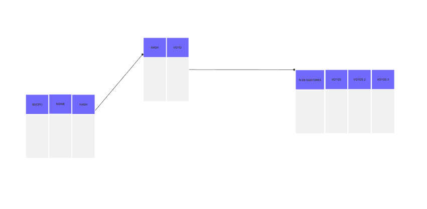

# Urna Eletrônica - Ariel Lima Abade Bandeira

## Objetivo, Funcionamento e Especificações

### Objetivo

O objetivo dessa urna eletrônica é pegar os dados de pessoas de determinada região (podendo ser municipal, estadual, regional, ou nacional) e fazer com que elas votem nas opções de nomenclaturas de objetos que mais funcionam. Nesse caso, os objetos em estudo são especificcamente "Tangerina, Bergamota e Mexerica" que estão sendo avaliados de acordo com a variação linguística.

### Funcionamento

Enquanto a votação estiver aberta, os dados são inseridos pelo usuário, armazenados em um Array usando o framework collections, para que possam ser feitas operações sobre eles, como contagem de votos, e postumamente, esses dados são transferidos para arquivos txt.|

** OBS: existe uma função para contar votos em cada classe, mas a contagem não foi implementada no arquivo txt por que achei desnecessário **

### Especificações do Projeto

- Versão utilizadas: Java 20
- IDE Utilizada: Netbeans
- Membros da Equipe: Ariel Bandeira


## Diagrama UML e Padrão de Projeto

O padrão de projeto utilizado foi o MVC, de tal forma que o *model* controlasse a organização das classes e interações entre os objetos na camada de dados, o *view* fosse responsável pela parte dde interação com o usuário, e o *controller* fosse responsável por salvar os arquivos finais dentro do arquivo em formato txt, com o objetivo de salvar o dado eleitor, que nesse caso, é cpf, seu respectivo voto, e consquentemente, gerar um hash único.

- Esse foi a organização do Model:


- Essa foi a organização do View:


- Essa foi a organização do Controller:




Inicialmente, a organização do controller possui 3 arquivos em formato de texto. Cada um deles possui um objetivo diferente.

1) Um arquivo de texto é apenas para guardar dados dos eleitores, em formato de ArraySet, utilizando o collections.

2) Um arquivo de texto é apenas para guardar os votos, também em formato de hash, e também, enquanto o programa for executado, ele deve guardar os dados dos candidatos votados em um ArrayList usando o collections.

3) O terceiro arquivo junta ambos os dados para criar um hash único.

*O objetivo dessa organização foi gerar baixo acoplamento entre as classes, de tal forma que, se um arquivo desses fosse corrompido, os outros não seriam afetados.*

## Organização de Classes

A organização geral do projeto no Netbeans se deu dessa forma:


Acima, é possível ter uma visão geral da organização de classes e de todo o projeto.

A classe *Candidato.java* é uma classe abstrata usada apenas para modelar os outros candidatos.

## Lógica de Negócio e Telas

Essa urna eletrônica é baseada em 3 telas.

A execução do arquivo sempre deve começar pela classe "Tela do Eleitor", que é representada abaixo:


Depois que o CPF for inserido, e passar por testes (será mencionado no próximo tópico), o usuário deve ir para a próxima tela, que é referente a votação. Essa tela contém o CPF do usuário, para trabalhar a responsabilidade e confiabilidade do sistema ao usuário utilizar ele. Para que o usuário vote, basta ele clicar no botão:


Depois disso, o usuário vai para uma tela de confirmação, onde pode conferir os dados alocados (CPF e Candidato Votado) e clicar em um botão para que a próxima pessoa vote, e, consequentemente, fazer o sistema voltar para o ínicio:


## Testes

O sistema foi feito com o intuito de minimizar ao máximo a interação manual com o usuário, dessa forma, o usuário, precisa, manualmente, apenas inserir o CPF na tela de votação.

Tendo isso em mente, existem dois casos problemáticos quando se trata da execução desse programa em memória, enquanto a votação estiver aberta:

1) Caso alguém queira fraudar a eleição, votar 2 vezes e ter CPF's repetidos dentro do sistema.

2) O usuário não colocar o número de caracteres necessários para validar o CPF.

Por isso, na tela de votação, ao clicar em "Inserir" existem dois processos de validação parra resolver exatamente esses problemas:


Dessa forma, se os erros do usuário e de fraude não passam por essa camada de validação, o usuário consequentemente não pode votar.


## Estrutura e Armazenamento

Enquanto o programa está em execução, os Candidatos, que neste caso, cada um dos candidatos (Tangerina, Bergamota e Mexerica) são armazenados em Arrays diferentes, com o intuito de facilitar operações que incidam sobre esses arrays e poupar processamento com relação a organização, seleção, e outras operações envolvendo estruturas de dados.

Além disso, a classe Eleitor também possui um armazenamento só para os dados do eleitor, com o intuito de facilitar operações que incidam sobre elas.

Independente do tipo de armazenamento, todos os dados estão sincronizados com os respectivos arquivos txt que são responsáveis por armazenar os dados.

Dessa forma, temos 3 arquivos txt:

1) Um que armazena apenas CPF e hash do CPF
2) Um que armazena apenas votos e hash dos Votos
3) Um que junta CPF e Voto em uma String, e gera um hash único baseado nisso.


## Criptografia

O modelo de criptografia utilizado foi o repassado no classroom, para Strings, especificamente, que foi adapatado para a criptografia do meu código e para minha lógica de negócio:

```
import java.security.MessageDigest;
import java.security.NoSuchAlgorithmException;

public class HashGenerator {
 
  public static String generateHash(String text) throws NoSuchAlgorithmException {
    MessageDigest digest = MessageDigest.getInstance("SHA-256");
    byte[] hashBytes = digest.digest(text.getBytes());
    StringBuilder hexString = new StringBuilder();

    for (byte b : hashBytes) {
      String hex = Integer.toHexString(0xff & b);
      if (hex.length() == 1) hexString.append('0');
      hexString.append(hex);
    }

    return hexString.toString();
  }


```


## Escala e Reuso

O código foi feito tentando respeitar os princípios da POO implementando reuso, tanto para abranger um número maior de palavras, como para comportar um número maior de votos.


